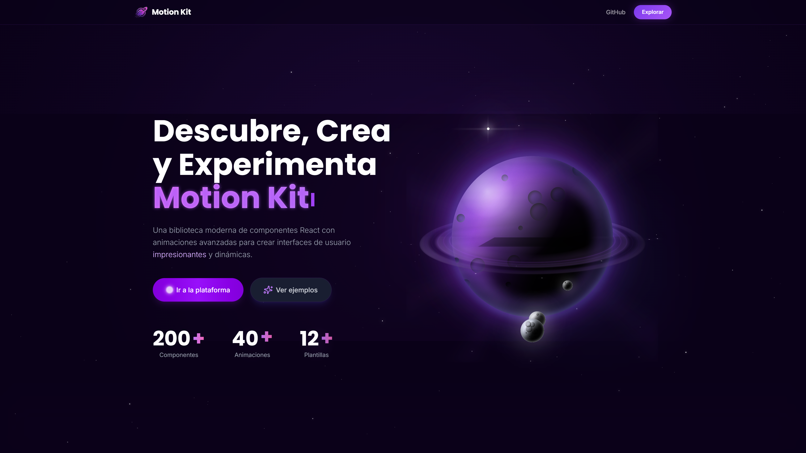

# Motion Kit - Arquitectura y Estructura del Código



## Tabla de Contenidos

- [Visión General de la Arquitectura](#visión-general-de-la-arquitectura)
- [Estructura de Directorios](#estructura-de-directorios)
- [Organización por Features](#organización-por-features)
- [Patrones de Diseño](#patrones-de-diseño)
- [Convenciones de Código](#convenciones-de-código)
- [Flujo de Datos](#flujo-de-datos)
- [Gestión de Estilos](#gestión-de-estilos)
- [Componentes Compartidos](#componentes-compartidos)

## Visión General de la Arquitectura

Motion Kit está construido siguiendo una arquitectura inspirada en **Feature-Sliced Design (FSD)**, donde las funcionalidades se dividen en capas claramente definidas (Core, Shared, Features). Esta aproximación facilita:

- **Escalabilidad**: Fácil agregar nuevas características y mantener el estado global
- **Mantenibilidad**: Código organizado y fácil de localizar
- **Reutilización**: Componentes de UI atómicos independientes
- **Rendimiento**: Carga diferida y manejo de estado optimizado (ej. Zustand)

### Stack Tecnológico

```
React + Vite + Framer Motion + React Router + Tailwind CSS + Zustand + Fuse.js
```

## Estructura de Directorios

```
src/
├── core/                  # Capa principal (Layouts, Stores globales, Buscador)
│   ├── search/            # Sistema de búsqueda global distribuido (Command Palette)
│   ├── store/             # Estados globales con Zustand (ej. useSearchStore)
│   └── ui/                # Layouts principales y envoltorios estructurales
├── features/              # Módulos por funcionalidad
│   ├── landing-feature/   # Página de aterrizaje de alto rendimiento
│   ├── home/              # Página de inicio con documentación
│   ├── buttons/           # Componentes de botones animados (Mapeo Data-Driven)
│   ├── cards/             # Componentes de cards animadas (Mapeo Data-Driven)
│   ├── not-found/         # Página 404
│   └── [other-features]/  # Otros módulos
├── shared/                # Componentes atómicos (UI compartida, hooks, transiciones)
├── routes.jsx            # Configuración de rutas
├── App.jsx              # Componente raíz
└── main.jsx             # Punto de entrada
```

## Organización por Features

Cada feature sigue una estructura consistente que promueve la modularidad y facilita el mantenimiento:

### Estructura Estándar de Feature

```
feature-name/
├── components/           # Componentes React del feature
│   ├── SubComponent/    # Componentes complejos en carpetas
│   │   ├── SubComponent.jsx
│   │   ├── animations.js     # Lógica de animaciones
│   │   ├── utils.js         # Utilidades específicas
│   │   └── index.jsx        # Exportaciones
│   ├── SimpleComponent.jsx  # Componentes simples
│   └── index.jsx           # Exportaciones centralizadas
├── data/                # Datos estáticos y configuraciones
├── providers/           # Context providers específicos
├── utils/              # Utilidades del feature
├── styles/             # Estilos específicos (si aplica)
├── index.jsx           # Punto de entrada del feature
└── doc.md             # Documentación del feature
```

### Ejemplo: Feature de Botones

```
buttons/
├── components/
│   ├── DeleteButton/
│   │   ├── DeleteButton.jsx    # Componente principal
│   │   ├── animations.js       # Configuraciones de animación
│   │   └── index.jsx          # Exportaciones
│   ├── MagneticButton/
│   ├── MorphButton/
│   ├── ParticleButton/
│   ├── SubmitButton/
│   └── index.jsx              # Exporta todos los botones
└── index.jsx                  # Vista principal de botones
```

## Patrones de Diseño

### 1. **Separación de Responsabilidades**

#### Componentes Puros
```jsx
// DeleteButton.jsx - Solo lógica del componente
const DeleteButton = () => {
  const [stage, setStage] = useState('initial');
  // Lógica del componente...
  
  return (
    <motion.button variants={buttonVariants}>
      {/* JSX */}
    </motion.button>
  );
};
```

#### Configuraciones de Animación
```javascript
// animations.js - Solo configuraciones
export const buttonVariants = {
  initial: { scale: 1 },
  hover: { scale: 1.05 },
  tap: { scale: 0.95 }
};
```

### 2. **Exportaciones Centralizadas**

```javascript
// components/index.jsx
export { default as DeleteButton } from './DeleteButton';
export { default as MagneticButton } from './MagneticButton';
export { default as MorphButton } from './MorphButton';
```

### 3. **Composición sobre Herencia**

```jsx
// Componente base reutilizable
const AnimatedButton = ({ children, variants, ...props }) => (
  <motion.button variants={variants} {...props}>
    {children}
  </motion.button>
);

// Componentes específicos que componen
const DeleteButton = () => (
  <AnimatedButton variants={deleteVariants}>
    Eliminar
  </AnimatedButton>
);
```

## Convenciones de Código

### Nomenclatura de Archivos

- **Componentes**: `PascalCase.jsx` (ej: `DeleteButton.jsx`)
- **Utilitades**: `camelCase.js` (ej: `animations.js`, `randomUtils.js`)
- **Datos**: `camelCase.js` (ej: `navItems.js`, `features.js`)
- **Estilos**: `kebab-case.css` (ej: `component-styles.css`)

### Estructura de Componentes

```jsx
// 1. Imports
import React, { useState } from 'react';
import { motion } from 'framer-motion';

// 2. Configuraciones y constantes
const ANIMATION_DURATION = 0.3;

// 3. Componente principal
const ComponentName = ({ prop1, prop2 }) => {
  // 3.1 Hooks de estado
  const [state, setState] = useState(initialState);
  
  // 3.2 Efectos y lógica
  useEffect(() => {
    // Efectos
  }, []);
  
  // 3.3 Handlers de eventos
  const handleClick = () => {
    // Lógica del handler
  };
  
  // 3.4 Render
  return (
    <motion.div>
      {/* JSX */}
    </motion.div>
  );
};

// 4. Exportaciones de código para documentación
export const componentJSX = `...`;
export const componentAnimations = `...`;

// 5. Exportación por defecto
export default ComponentName;
```

### Organización de Imports

```jsx
// 1. React y hooks
import React, { useState, useEffect } from 'react';

// 2. Librerías externas
import { motion, AnimatePresence } from 'framer-motion';
import { Link } from 'react-router-dom';

// 3. Componentes internos
import SubComponent from './SubComponent';
import { sharedComponent } from '../../shared';

// 4. Utilitades y configuraciones
import { animations } from './utils/animations';
import { data } from '../data/componentData';
```

## Flujo de Datos

### Arquitectura de Estado

El proyecto utiliza **Zustand** para manejar el estado global de forma ligera y sin re-renderizados innecesarios, combinado con un patrón de registro distribuido para el buscador.

```
App.jsx
├── Core Layout (Zustand Global State / SearchModal)
│   ├── Navbar (Local State)
│   ├── Sidebar (Local State)
│   └── Main Content
│       └── Feature Components (Data-Driven mapping, Local State)
└── Routes
```

### Gestión de Estado por Niveles

1. **Estado Global (Zustand)**: Sistema de búsqueda global (Command Palette), temas.
2. **Registro de Búsqueda Distribuido**: Cada conjunto de componentes exporta sus metadatos a `core/search/registry`.
3. **Estado de Feature**: Datos específicos del módulo, manejados a menudo mediante mapeo estático (`data.jsx`).
4. **Estado de Componente**: Estado local y temporal de cada animación y componente atómico.

```jsx
// Ejemplo de flujo de datos en Layout
const Layout = () => {
  // Estado global del layout
  const [sidebarOpen, setSidebarOpen] = useState(false);
  
  return (
    <div>
      <Navbar onToggleSidebar={() => setSidebarOpen(!sidebarOpen)} />
      <Sidebar isOpen={sidebarOpen} />
      <Main />
    </div>
  );
};
```

## Gestión de Estilos

### Jerarquía de Estilos

1. **Tailwind CSS**: Utilidades base y diseño responsivo
2. **CSS Modules**: Estilos específicos por componente
3. **Styled Components con Motion**: Animaciones dinámicas

### Convenciones de Clases

```jsx
// Estructura de clases consistente
<motion.button 
  className="
    // Layout y espaciado
    px-6 py-3 rounded-lg
    // Colores y tema
    bg-purple-600 text-white
    // Estados
    hover:bg-purple-700 focus:ring-2 focus:ring-purple-500
    // Responsive
    sm:px-8 md:py-4
    // Utilidades
    transition-colors duration-300
  "
>
```

### Sistema de Colores

```css
/* Paleta principal */
--purple-primary: #8b5cf6;
--purple-secondary: #a78bfa;
--gray-dark: #1f2937;
--gray-medium: #374151;
```

## Componentes Compartidos

### Ubicación: `src/shared/`

Componentes reutilizables en múltiples features:

```
shared/
├── ComponentCard.jsx     # Card para mostrar componentes
├── OutletWrapper.jsx     # Wrapper para rutas
└── [otros-compartidos]   # Otros componentes base
```

### Ejemplo de Componente Compartido

```jsx
// ComponentCard.jsx - Componente reutilizable
const ComponentCard = ({ 
  title, 
  description, 
  component, 
  jsxCode, 
  animationCode 
}) => {
  return (
    <div className="component-card">
      {/* Implementación reutilizable */}
    </div>
  );
};
```

## Extensibilidad

### Agregar un Nuevo Feature

1. **Crear estructura de carpetas**:
```bash
mkdir src/features/nuevo-feature
mkdir src/features/nuevo-feature/components
mkdir src/features/nuevo-feature/data
```

2. **Implementar componentes siguiendo convenciones**
3. **Actualizar rutas en `routes.jsx`**
4. **Agregar navegación en `navItems.jsx`**

### Agregar un Nuevo Componente

1. **Crear en la carpeta de components del feature**
2. **Seguir estructura estándar**
3. **Exportar en `index.jsx` del feature**
4. **Documentar con código de ejemplo**


### Principios Aplicados

- **Single Responsibility**: Cada archivo tiene una responsabilidad clara
- **DRY (Don't Repeat Yourself)**: Componentes reutilizables
- **Separation of Concerns**: Lógica, estilos y datos separados
- **Convention over Configuration**: Estructura predecible

---

Esta arquitectura proporciona una base sólida para el crecimiento y mantenimiento del proyecto Motion Kit.